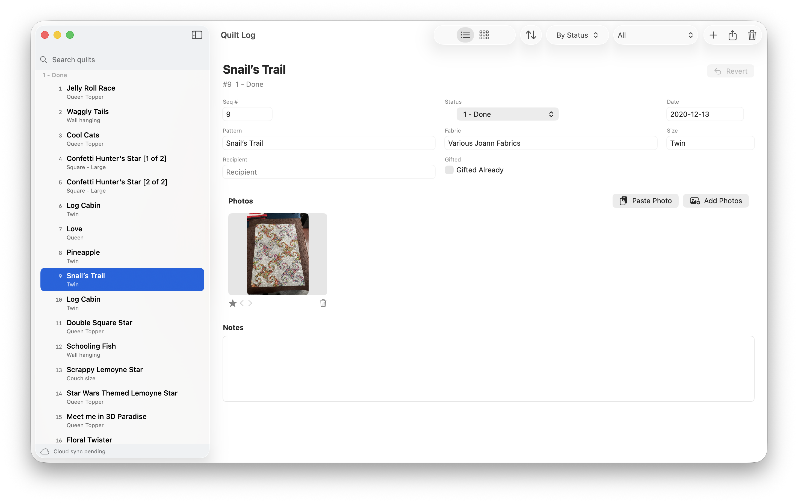
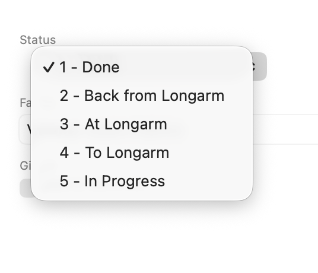
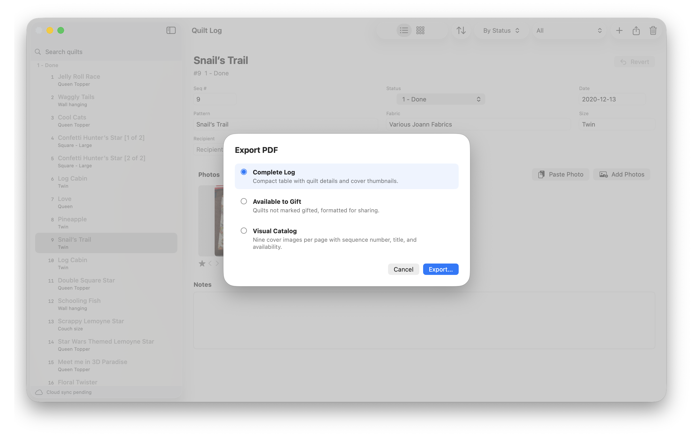
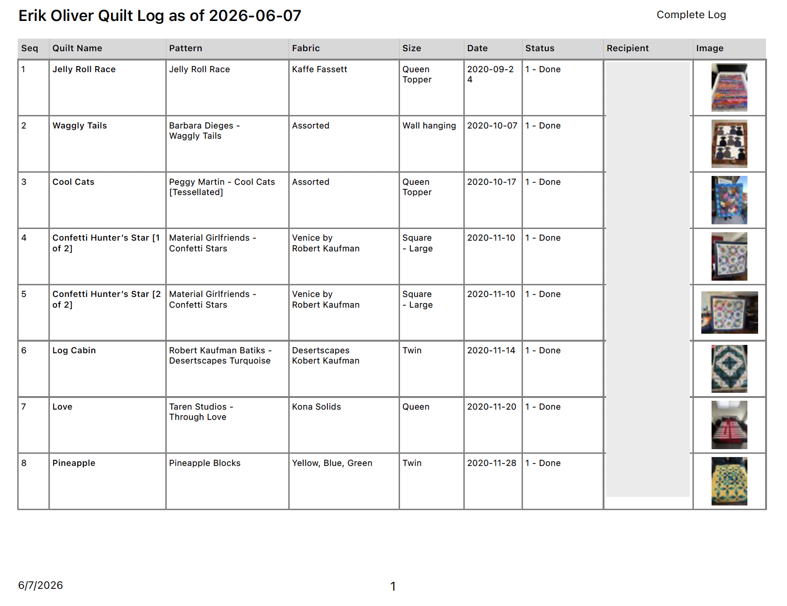
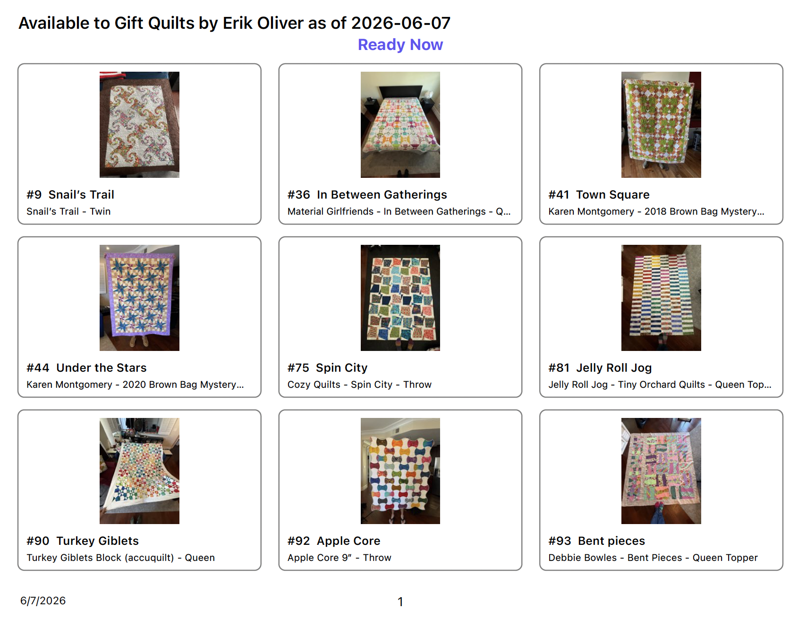
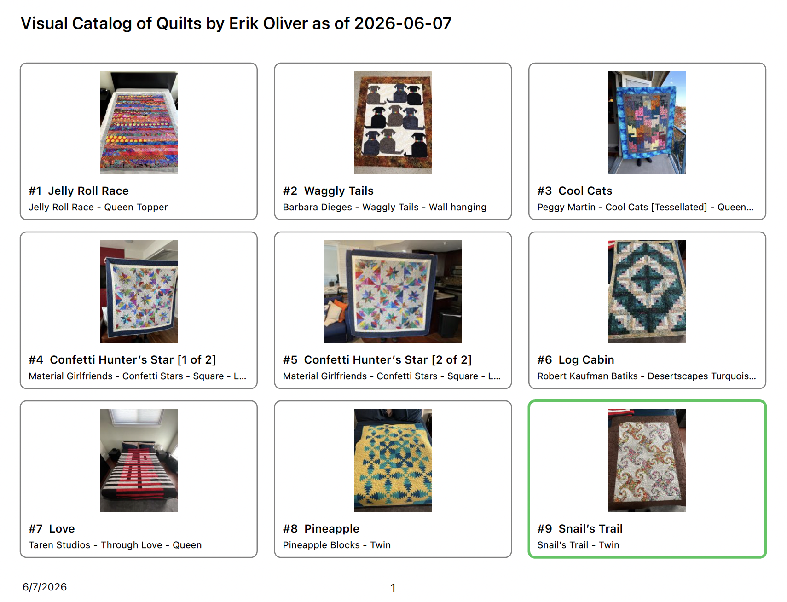

# Quilt Log

Quilt Log is a simple app for keeping track of the quilts you have made, are making, and are ready to give away. It works on Mac, iPad, and iPhone, so your quilt list can live where you actually use it: at your sewing table, on the couch, or when you are checking what you have available for a gift.


## What You Can Track

Each quilt record can include the basics you want to remember:

- Quilt name and sequence number
- Pattern, fabric, colors, and size
- Start and finish dates
- Status, such as planned, in progress, finished, gifted, or available
- Recipient and gift details
- Notes
- Photos



## Browse And Search

Use the gallery to scan your quilts visually, or switch to a more compact list when you want to move through records quickly. Quilts are grouped by status, which makes it easy to see what is finished, what is still in progress, and what is available to give away.

Search works across the main quilt details, including names, patterns, fabric, sizes, dates, recipients, notes, and sequence numbers.



## Export Useful PDFs

Quilt Log can create PDFs for the views people often want outside the app:

- A detailed quilt log
- A list of quilts available to gift
- A visual catalog with photos

These are useful for sharing, printing, or keeping a separate backup of your work.









## Backups And Sync

### iCloud Synchronization By Default

By default, Quilt Log stores your quilt library in your private iCloud account and synchronizes it through Apple's iCloud system. This uses your iCloud storage and is what lets the same quilt records appear on your Mac, iPad, and iPhone when you are signed in with the same Apple account and have iCloud available.

Edits are saved locally first, then synchronized by iCloud when your device is online and Apple decides conditions are right. Because the library is already stored in iCloud, normal Apple account, iCloud storage, and backup settings apply.

### Mac-Only Import And Export

The Mac version also includes import and export tools. Use these when you want a separate archive or want a copy of your information outside the app.

On the Mac, a ZIP backup can be exported that includes your quilt data and images for use outside the program.

## Privacy

Quilt Log does not collect, sell, share, track, or analyze your quilt data. The app does not include developer-operated analytics, advertising, telemetry, cookies, or an account system.

Your quilt records and photos stay in your local app library and, when iCloud is available and enabled for your Apple account, in your private Apple iCloud storage. That synchronization is handled by Apple’s iCloud system, not by a Quilt Log server.

If you email the developer for support, questions, feedback, or TestFlight access, the developer will see the information you choose to send, including your email address. That information is used only to respond to you, help with the app, or manage TestFlight participation.

For TestFlight users, Apple provides standard TestFlight diagnostics and telemetry to developers through App Store Connect. That Apple-provided TestFlight information is separate from Quilt Log’s own data collection; the app itself does not include developer-operated analytics or tracking.

## For Developers

### Building From Source

Open `QuiltLog.xcodeproj` in Xcode and run the `QuiltLog` scheme.

The app does not require import scripts or generated seed data.

To package a notarized app for release, place `QuiltLog.app` in the ignored `dist/` folder and run:

```zsh
scripts/make_dmg.sh
```

The script checks the app signature, creates `dist/QuiltLog-<version>.dmg`, verifies the DMG, and checks the packaged app signature.

Run tests with:

```zsh
xcodebuild test -project QuiltLog.xcodeproj -scheme QuiltLog -destination 'platform=macOS' -derivedDataPath .DerivedData
```

The unit test target also supports iPhone and iPad simulator runs. Use an installed simulator name from `xcrun simctl list devices available`, for example:

```zsh
xcodebuild test -project QuiltLog.xcodeproj -scheme QuiltLog -destination 'platform=iOS Simulator,name=iPhone 17' -derivedDataPath .DerivedData
xcodebuild test -project QuiltLog.xcodeproj -scheme QuiltLog -destination 'platform=iOS Simulator,name=iPad Pro 11-inch (M5)' -derivedDataPath .DerivedData
```

Mac-only backup import/export tests are compiled out on iOS; shared store, preference, and PDF tests run on both platforms.

Debug simulator builds include a small sanitized sample library for working without iCloud. When the simulator library is empty, use **Load Sample Data** in the app to import 18 representative quilts with thumbnails. The sample payload lives in `QuiltLog/SampleData/SampleQuiltLogBackup` and can be regenerated from a full backup with:

```zsh
uv run --python 3.14 python scripts/make_sample_backup.py 'dist/20260608 Quilt Log Backup.zip' QuiltLog/SampleData/SampleQuiltLogBackup
```

### License

Apache-2.0
